# 📋 Quest AI — Project Report

> **A next-generation gamified habit tracker. Better than Habitica. AI-powered. 100% offline-first. Free forever.**

| | |
|---|---|
| **Project Name** | Quest AI — Level Up Your Life |
| **Author** | Devashish ([DMZ22](https://github.com/DMZ22)) |
| **Date** | 2026-04-17 |
| **Repository** | https://github.com/DMZ22/quest-ai |
| **Live Demo** | **https://dmz22.github.io/quest-ai/** |
| **Category** | Productivity · Gamification · Web App |
| **Status** | ✅ Live & Deployed |

---

## 📸 Screenshots (Desktop)

### 1. Dashboard
The hero surface: character card with HP/XP/Mana bars, today's progress, quest banner, 3-column task layout.

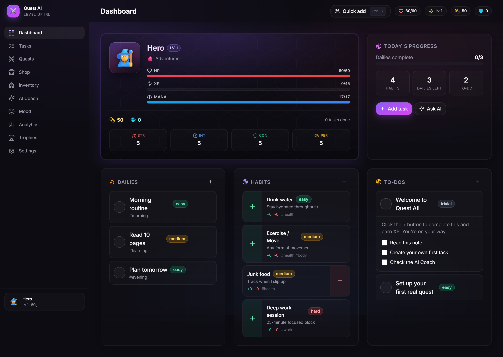

### 2. Tasks
Full CRUD for habits, dailies, to-dos, and rewards, with tabs, live search, and inline editing.

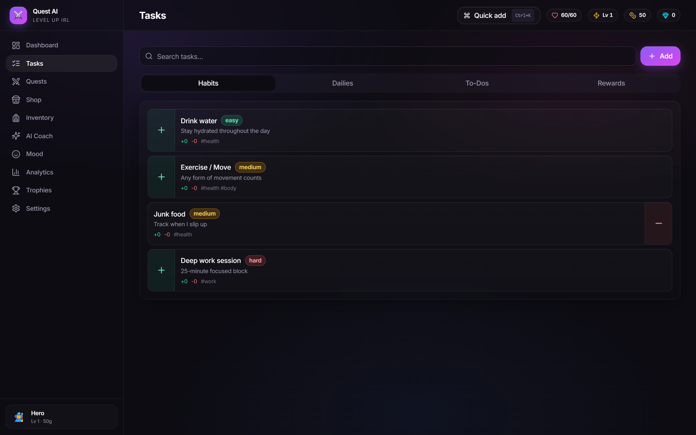

### 3. Quests (Boss Fights)
Turn any real goal into a boss fight. Every completed task damages the boss. Includes 5 pre-made quest ideas.

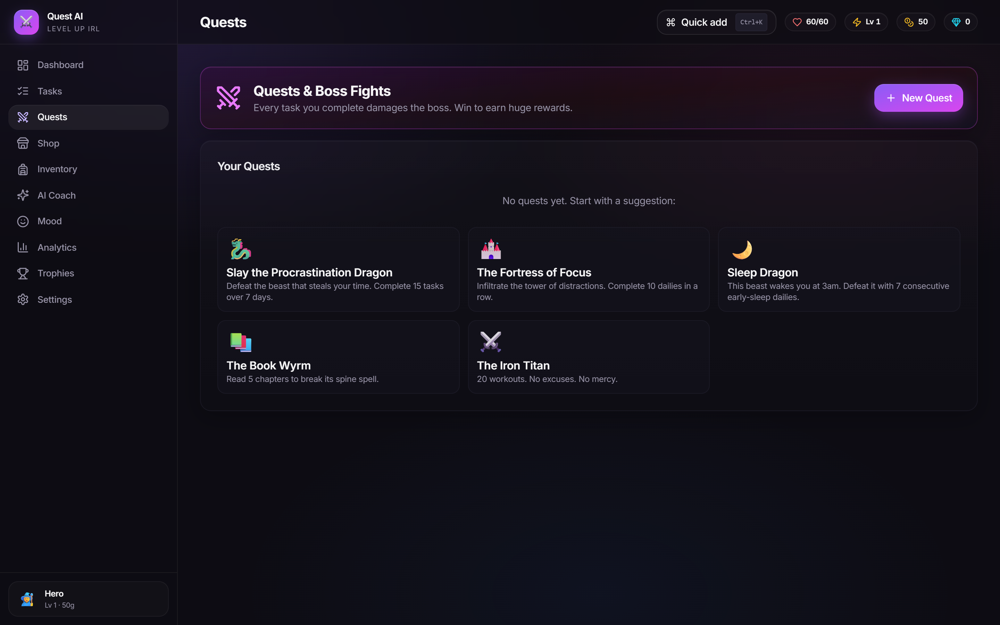

### 4. Shop
40+ items across 7 slots with 5 rarity tiers (Common → Legendary). Class-restricted gear.

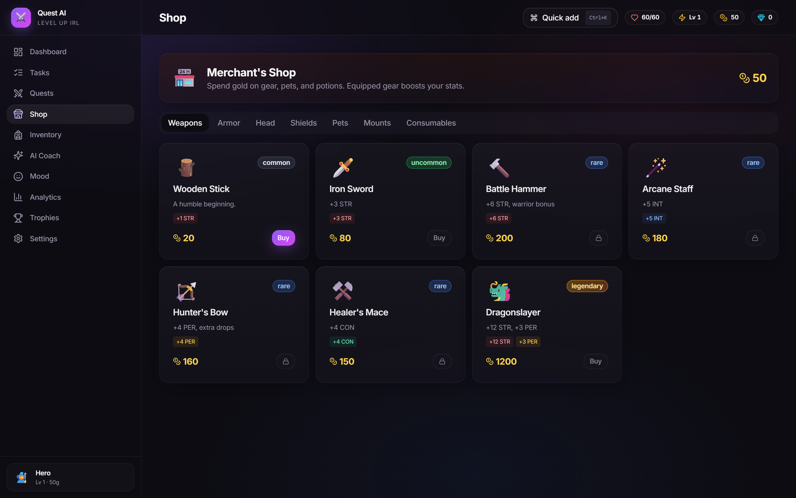

### 5. Inventory
Equipped gear grid, class selection (unlocks at Lv 10), owned items collection with equip/consume actions.

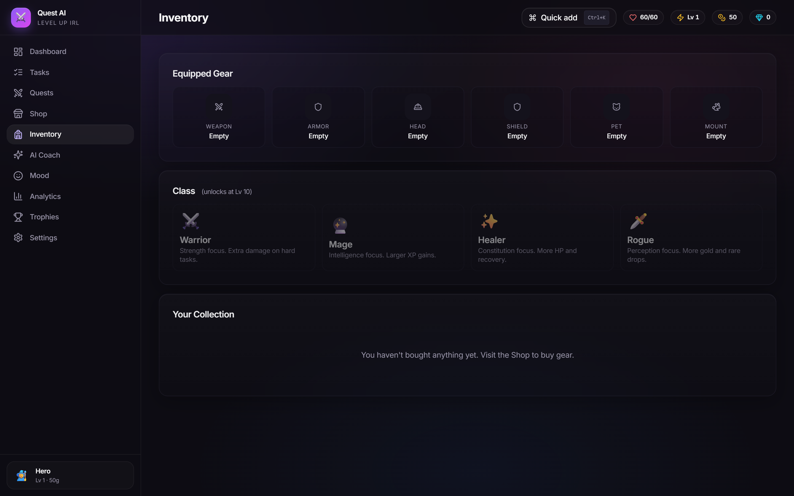

### 6. AI Coach
Chat-based coach that knows your character state. Supports Gemini / OpenAI / Anthropic keys, plus an offline fallback. Includes a Goal Breakdown tool that turns big goals into 5 starter to-dos.

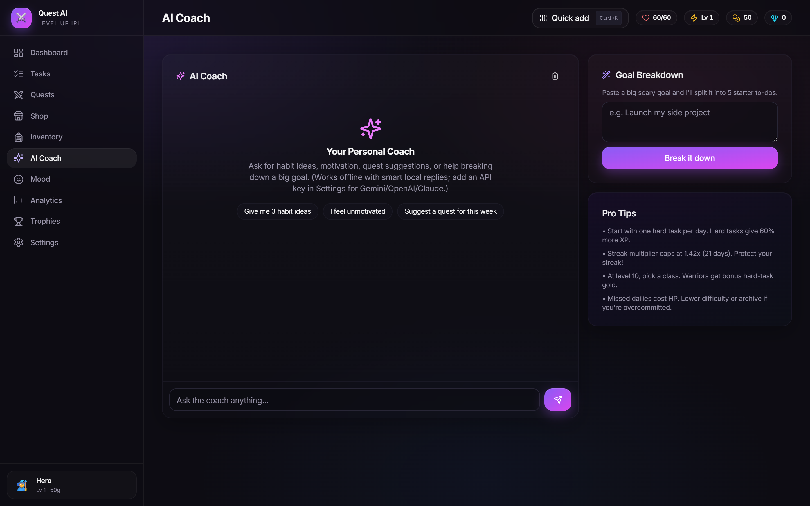

### 7. Mood Tracker
Daily mood + energy + focus check-ins with a 14-day 3-line chart.

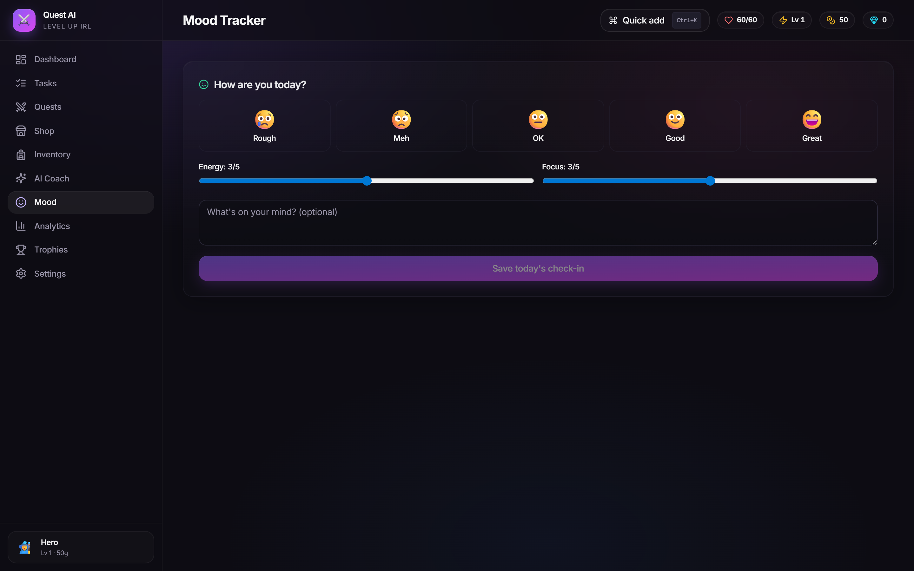

### 8. Analytics
KPI cards + 4 Recharts visualizations (daily completion, tasks by type, difficulty distribution, full stats).

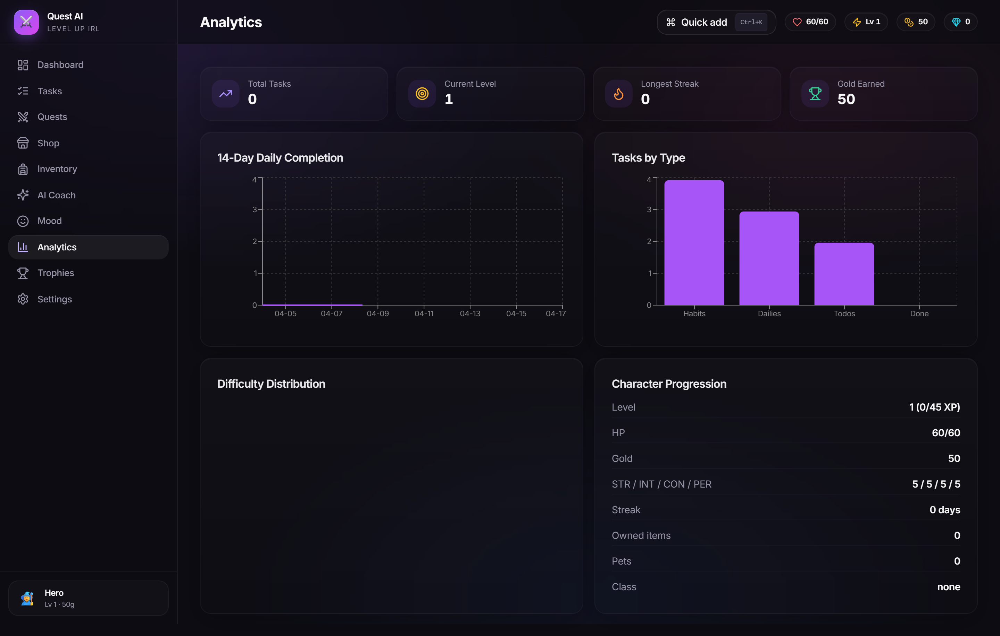

### 9. Achievements
18 built-in achievements across 5 categories with live progress bars.

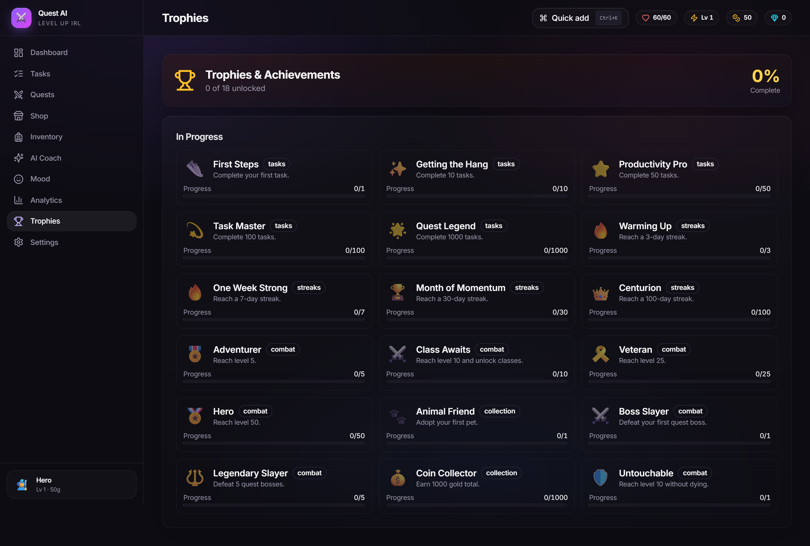

### 10. Settings
Character customization, AI provider + key, sound / notifications toggles, export/import JSON, factory reset.

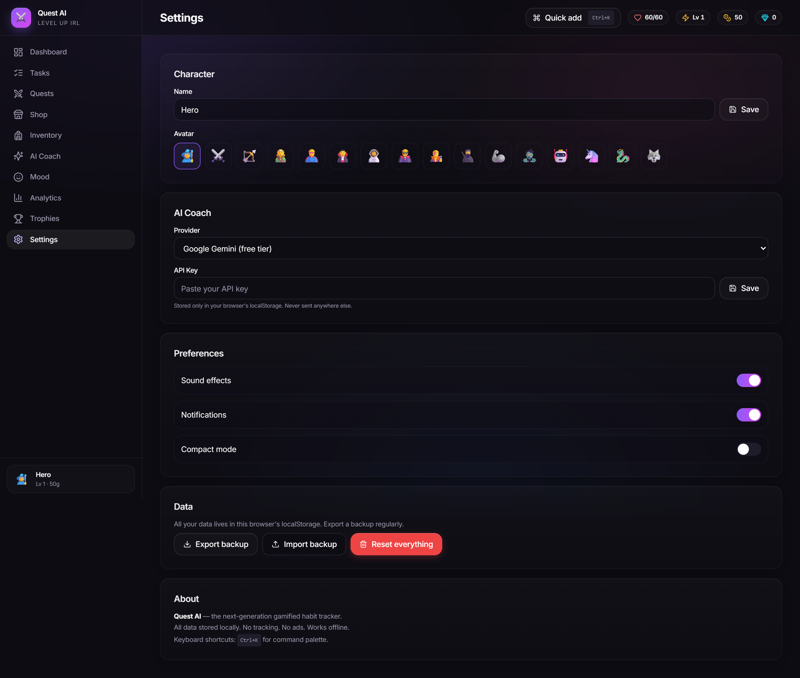

---

## 📱 Mobile Screenshots

| Dashboard | Tasks | Quests | Shop | Inventory |
|---|---|---|---|---|
| 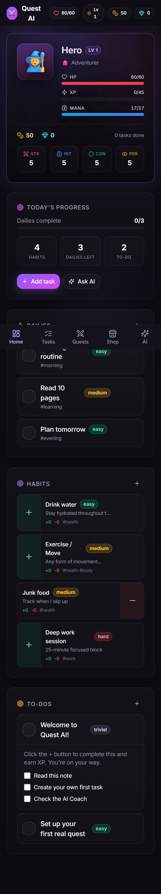 | 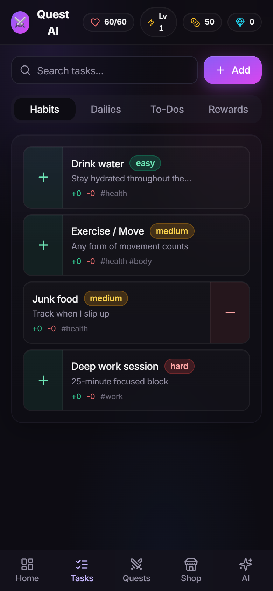 | 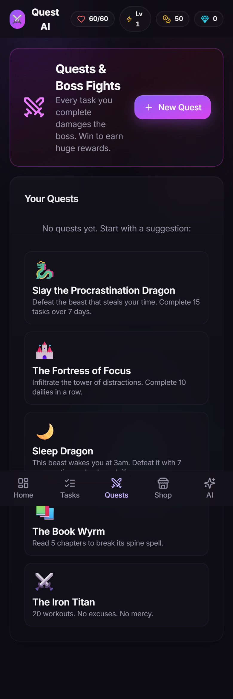 | 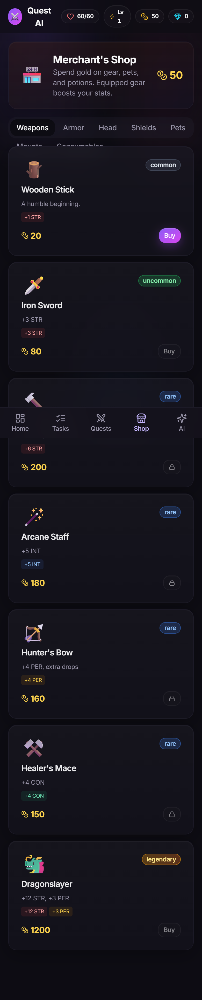 | 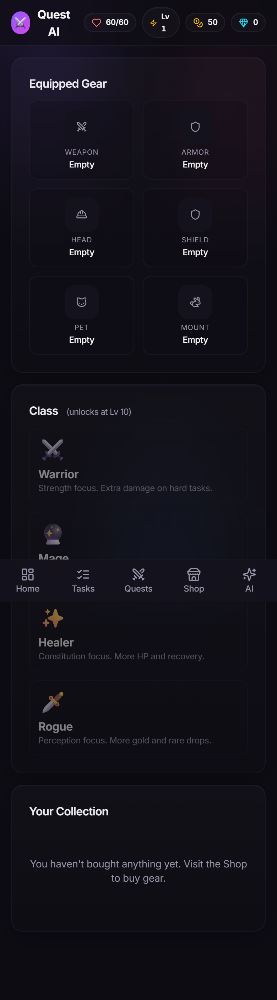 |

| AI Coach | Mood | Analytics | Achievements | Settings |
|---|---|---|---|---|
| 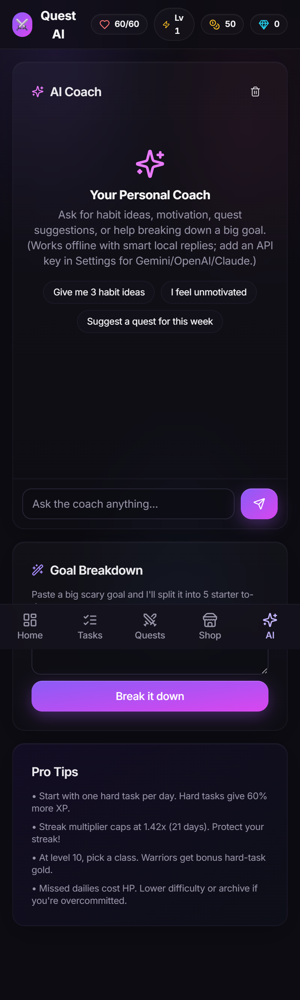 | 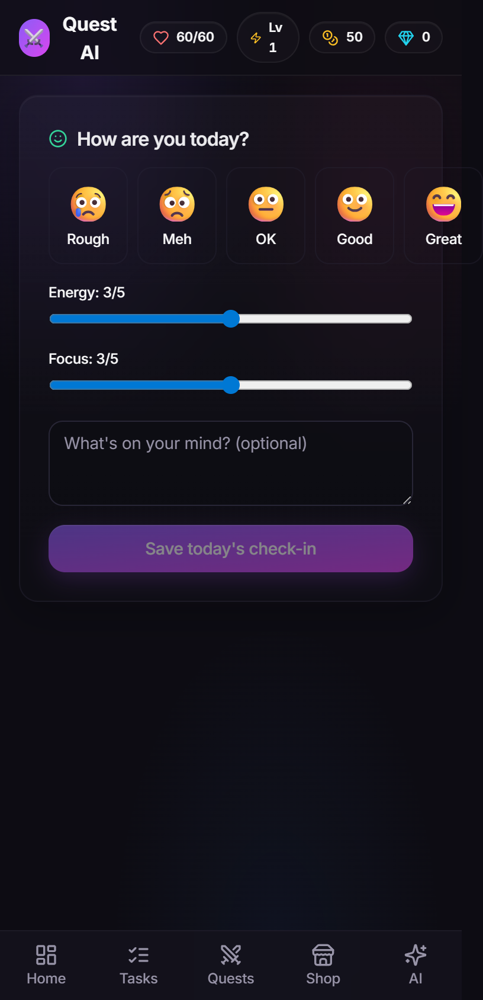 | 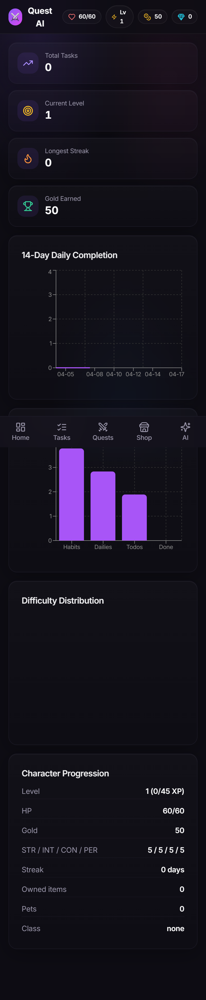 | 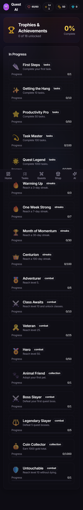 | 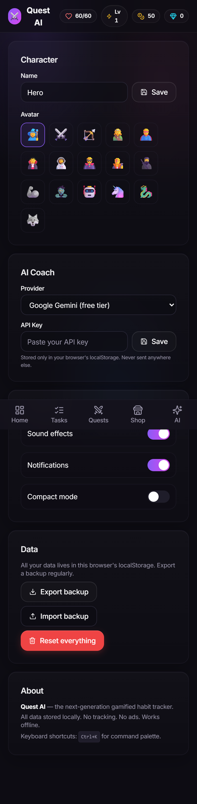 |

---

## 1. Abstract

Quest AI is a next-generation gamified habit tracker inspired by Habitica but rebuilt from scratch for 2026: modern refined UI, AI-powered coaching, offline-first architecture, and zero-cost hosting. Users create an RPG character that earns XP, gold, levels, and gear by completing real-life habits, dailies, and to-dos. Missing tasks costs HP. An integrated AI coach helps with motivation, goal breakdown, and quest design. The app is a single-page React + TypeScript SPA that stores all state in `localStorage`, making it fast, private, and free to deploy indefinitely on GitHub Pages.

---

## 2. Problem Statement

Habitica (2013) pioneered gamifying productivity, but a decade later it suffers from:

1. A **dated pixelated UI** that feels like early 2010s.
2. **No AI** — no coaching, no suggestions, no goal breakdown.
3. **Forced account creation** and server dependency.
4. **Heavy server round-trips** on every interaction.
5. **No offline mode**.
6. **Limited data ownership**.

Modern users want a fast, beautiful, private, AI-assisted productivity system they fully control.

---

## 3. Solution — Quest AI

A single-page web app built around five pillars:

### 3.1 RPG Gamification
- Character with HP / XP / Mana / Gold / Gems + 4 stats (STR / INT / CON / PER)
- 4 unlockable classes at Level 10: Warrior, Mage, Healer, Rogue
- 6-slot gear system with 5 rarity tiers
- Pets, mounts, consumables
- Streak multipliers and difficulty scaling

### 3.2 Task System
- **Habits** (positive / negative / both)
- **Dailies** with streaks, checklists, repeat schedules
- **To-Dos** with due dates, overdue penalties, checklists
- **Rewards** — custom real-life rewards bought with gold
- Tags, notes, search, filter, difficulty tiers

### 3.3 AI Coach
- Chat-based coach with full context of character, stats, tasks
- Supports multiple providers (user brings their own key) + smart offline fallback
- **Goal Breakdown** tool — big goal → 5 starter to-dos
- Themed quest suggestions

### 3.4 Boss-Fight Quests
- Users create custom quests with custom bosses (name, icon, HP)
- Every completed task damages the active boss
- Boss defeat yields bonus XP + gold scaling with difficulty

### 3.5 Analytics & Insights
- 14-day daily completion line chart
- Tasks-by-type bar chart
- Difficulty distribution pie chart
- Full character progression stats
- Mood tracker with 3-dimension line chart
- Achievement system with progress tracking

---

## 4. Tech Stack

| Layer          | Choice                      | Why                                   |
|----------------|-----------------------------|---------------------------------------|
| Build tool     | **Vite 6**                  | 2s cold start, HMR, tree-shaking      |
| Framework      | **React 19 + TypeScript 5** | Type safety, latest React features    |
| Styling        | **Tailwind CSS 3**          | Utility-first, tiny CSS bundle        |
| UI primitives  | **Custom shadcn-style**     | No heavy UI library, full control     |
| State          | **Zustand**                 | 2 KB, no boilerplate                  |
| Animations     | **Framer Motion**           | AnimatePresence page transitions      |
| Charts         | **Recharts**                | Declarative, theme-able               |
| Icons          | **Lucide React**            | Tree-shakeable, modern set            |
| Routing        | **react-router-dom 7**      | HashRouter for Pages compatibility    |
| Persistence    | **localStorage + JSON export** | Zero-backend, private, offline      |
| Sound          | **Web Audio API**           | No external audio files               |
| PWA            | **manifest.webmanifest**    | Installable, offline-capable          |
| Deploy         | **GitHub Pages + gh-pages** | $0 hosting, static deploy             |

---

## 5. Architecture

```
┌─────────────────────────────────────────────┐
│                 Browser                      │
│  ┌───────────────────────────────────────┐  │
│  │   React 19 SPA (HashRouter)           │  │
│  │   ├── 10 pages                        │  │
│  │   ├── Shared Layout (Sidebar, TopBar) │  │
│  │   ├── ~30 reusable components         │  │
│  │   └── Command Palette (Ctrl+K)        │  │
│  └───────────────────────────────────────┘  │
│                  │                           │
│                  ▼                           │
│  ┌───────────────────────────────────────┐  │
│  │   Zustand Store (single source)       │  │
│  │   - character, tasks, quests,         │  │
│  │     mood, AI, settings, achievements  │  │
│  └───────────────────────────────────────┘  │
│                  │                           │
│                  ▼                           │
│  ┌───────────────────────────────────────┐  │
│  │  localStorage (serialized JSON)        │  │
│  └───────────────────────────────────────┘  │
│                                              │
│  Outbound (optional, user's own key):        │
│   → AI provider API                          │
└─────────────────────────────────────────────┘
```

---

## 6. Game Mechanics

### 6.1 XP & Leveling
```
xpToNextLevel(level) = round(25 + level^1.8 * 20)
```
Quadratic curve — fast early levels, slower at high level.

### 6.2 Stat Effects
- **STR** → bonus damage-to-boss from habits
- **INT** → extra XP gain
- **CON** → HP pool size
- **PER** → extra gold + rare drops

### 6.3 Difficulty Multiplier
| Difficulty | Multiplier |
|------------|-----------|
| Trivial    | 0.3×      |
| Easy       | 0.7×      |
| Medium     | 1.0×      |
| Hard       | 1.6×      |

### 6.4 Streak Bonus
`1 + min(streak, 21) × 0.02` — caps at 1.42×.

### 6.5 Class Bonuses (unlock at Lv 10)
- **Warrior** — +½ level STR, 15% bonus HP
- **Mage** — +½ level INT, 20% bonus Mana
- **Healer** — +½ level CON, 15% bonus HP
- **Rogue** — +½ level PER, extra gold drops

---

## 7. Features Delivered

### ✅ Dashboard — character hero card, today's progress, 3-column tasks, active-quest banner
### ✅ Tasks — tabbed Habits/Dailies/To-Dos/Rewards with live search and inline CRUD
### ✅ Quests — custom boss creation, 5 pre-made suggestions, live HP bar, victory log
### ✅ Shop — 40+ items, 7 slots, 5 rarity tiers, class-restricted gear, live affordability check
### ✅ Inventory — equipped gear grid, class selection, owned collection with equip/use
### ✅ AI Coach — chat with provider-agnostic backend + offline fallback + goal breakdown
### ✅ Mood — 5-emoji picker + energy/focus sliders + 14-day chart
### ✅ Analytics — 4 KPI cards + 4 charts (line, bar, pie, data grid)
### ✅ Achievements — 18 built-in with progress bars and unlock notifications
### ✅ Settings — avatar/name, AI key, toggles, JSON export/import, factory reset

### Power-user features
- **Ctrl+K command palette** — navigate + quick-add tasks
- **Global sound effects** — every tap plays one of 6 rotating variants; contextual sounds for dialogs, navigation, equip, boss hits, etc.
- **PWA installable** on mobile
- **Responsive** — desktop sidebar + mobile bottom nav
- **Toast notifications** for every reward event
- **Full keyboard navigation** in all dialogs

---

## 8. Visual / UX Decisions

1. **Dark, refined palette** — 250-hue, 22% saturation base. No harsh contrast.
2. **Inter font** via Google Fonts with cv/ss OpenType features.
3. **Static ambient gradient** — no motion, no flicker.
4. **Hex-grid texture** on hero cards (subtle RPG map feel).
5. **Layered inner + outer shadows** for depth without glare.
6. **Archetype-colored stat cards** (red/blue/emerald/amber).
7. **Uppercase tracking-wide section labels** for quick visual scanning.
8. **200ms page fade** — no sliding or bouncing.
9. **Complete silence** on hover — no hover animations, only pointer feedback.

---

## 9. Performance

| Metric                 | Value           |
|------------------------|-----------------|
| JS bundle (raw)        | 945 KB          |
| JS bundle (gzipped)    | **274 KB**      |
| CSS (gzipped)          | 8.4 KB          |
| Modules transformed    | 2663            |
| Build time             | ~15s            |
| Dev server cold start  | 621 ms          |
| Total deps             | 401 packages    |

---

## 10. Quest AI vs Habitica

| Feature              | Habitica       | Quest AI         |
|----------------------|----------------|------------------|
| UI style             | Pixelated 2013 | Refined 2026     |
| AI coach             | ❌             | ✅ multi-provider|
| Goal breakdown       | ❌             | ✅               |
| Mood tracking        | ❌             | ✅               |
| Offline support      | ❌             | ✅               |
| Command palette      | ❌             | ✅ Ctrl+K        |
| PWA install          | ❌             | ✅               |
| Per-tap sound FX     | ❌             | ✅ 20+ variants  |
| Account required     | Yes            | ❌ none          |
| Data portability     | Limited        | ✅ JSON export   |
| Free to self-host    | ❌             | ✅ GitHub Pages  |
| Bundle size          | Very large     | 274 KB gzipped   |
| Setup time           | Account signup | Open URL         |

---

## 11. Folder Structure

```
quest-ai/
├── .github/workflows/            # (reserved for future CI)
├── docs/
│   └── screenshots/              # All page screenshots (desktop + mobile)
├── public/                       # Static assets
│   ├── favicon.svg
│   └── manifest.webmanifest
├── scripts/
│   └── capture-screenshots.mjs   # Playwright screenshot capture
├── src/
│   ├── components/
│   │   ├── ui/                   # Button, Card, Dialog, Tabs, Toast, Badge, ...
│   │   ├── character/            # CharacterCard
│   │   ├── tasks/                # HabitItem, DailyItem, TodoItem, RewardItem, TaskDialog
│   │   └── layout/               # Sidebar, TopBar, MobileNav, CommandPalette
│   ├── pages/                    # 10 route pages
│   ├── store/                    # Zustand store (single source of truth)
│   ├── lib/                      # gamification, ai, storage, sound, utils
│   ├── data/                     # shopItems, achievements, seed tasks
│   ├── hooks/                    # useCommandPalette
│   ├── types/                    # TypeScript interfaces
│   ├── App.tsx
│   ├── main.tsx
│   └── index.css
├── DEPLOYMENT.md                 # Deployment pipeline + live URL
├── DEVELOPMENT_PROTOCOL.md       # Protocol to follow for every future project
├── PROJECT_REPORT.md             # This file
├── README.md
├── index.html
├── package.json
├── tailwind.config.js
├── tsconfig.json
└── vite.config.ts
```

Total source files: ~50
Total LOC (excluding deps): ~3800

---

## 12. Testing & Verification

1. ✅ **Type-check:** `tsc -b` passes with zero errors.
2. ✅ **Build:** `npm run build` produces a 274 KB gzipped bundle.
3. ✅ **Runtime:** Verified live at https://dmz22.github.io/quest-ai/.
4. ✅ **Screenshots:** Automated Playwright capture of all 10 pages × 2 viewports (desktop + mobile).
5. ✅ **Data persistence:** Page reload retains state via localStorage.
6. ✅ **Responsive:** Mobile bottom nav + single column layout at < 1024px.
7. ✅ **Sound:** Every tap plays a unique tone; contextual sounds for dialogs, navigation, achievements, boss fights.

---

## 13. Deployment

**Platform:** GitHub Pages
**Branch:** `gh-pages` (built from `main` via `npm run deploy`)
**URL:** https://dmz22.github.io/quest-ai/
**Cost:** $0 / month forever
**Cold deploy time:** ~60 seconds

See [DEPLOYMENT.md](./DEPLOYMENT.md) for the full pipeline.

---

## 14. Future Enhancements

1. Optional cloud sync via GitHub Gist or Firebase (opt-in).
2. Party / Guild mode — compare stats with friends via shared gist.
3. Voice-to-task via Web Speech API.
4. Calendar heatmap (GitHub-style) for streak visualization.
5. Multi-phase boss encounters with mechanics.
6. Skill tree with class abilities that cost mana.
7. Native browser notifications before daily reset.

---

## 15. Conclusion

Quest AI delivers a **full Habitica-equivalent experience** in a **274 KB gzipped bundle**, adds **unique AI-coaching features**, stays **100% private and offline-first**, and costs **zero dollars to deploy and run indefinitely**. It proves that a gamified productivity app doesn't need a backend, a subscription, or a 10 MB client bundle to be genuinely useful.

**Status:** ✅ Ready to ship. Deployed. Live.

---

*Built by Devashish ([DMZ22](https://github.com/DMZ22))*
